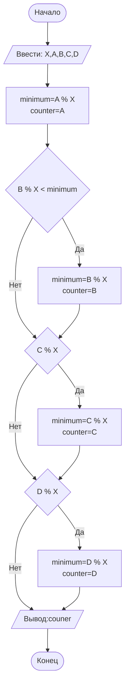

## Отчет по лабораторной работе № 1

#### № группы: `ПМ-2601`

#### Выполнил:`Павельев Арсений Андреевич`

#### Вариант: `17`

### Cодержание:

- [Постановка задачи](#1-постановка-задачи)
- [Входные и выходные данные](#2-входные-и-выходные-данные)
- [Выбор структуры данных](#3-выбор-структуры-данных)
- [Алгоритм](#4-алгоритм)
- [Программа](#5-программа)
- [Анализ правильности решения](#6-анализ-правильности-решения)

### 1. Постановка задачи

> Программа получает натурально число X и четыре целых числа A,B,C,D. Необходимо
> определить число, имеющее наименьший остаток от деления на число X.

Данную задачу можно разделить на 2 подзадачи:
- Получение пяти переменных и запоминание их .
- Анализ остатков деления и вывод на экран ответа.

> Пример: Пусть X=5, A=12, B=-7, C=20, D=3.
> Остатки: 12%5=2; -7%5=-2; 20%5=0; 3%5=3.
> Минимальный остаток: -2 у числа -7. Ответ: -7.

### 2. Входные и выходные данные

#### Данные на вход

На вход программа должна получать 5 чисел, X-натуральное число и A,B,C,D- целые числа .

|             | Тип               | min значение | max значение     |
|-------------|-------------------|--------------|------------------|
| X (Число 1) | Натуральное число |      1       | 2<sup>31</sup>-1 |
| A (Число 2) | Целое число       | -2<sup>31    | 2<sup>31</sup>-1 |
| B (Число 3) | Целое число       | -2<sup>31    | 2<sup>31</sup>-1 |
| C (Число 4) | Целое число       | -2<sup>31    | 2<sup>31</sup>-1 |
| D (Число 5) | Целое число       | -2<sup>31    | 2<sup>31</sup>-1 |


#### Данные на выход

Программа на выходе дает одно целое число (из A,B,C,D),у которого остаток от деления на X минимален.

|         | Тип   | min значение | max значение     |
|---------|-------|--------------|------------------|
| Число 1 | Целое |  -2<sup>31   | 2<sup>31</sup>-1 |

### 3. Выбор структуры данных

Программа получает 5 чисел:X-натуральное число;A,B,C,D-целые числа,которые больше -2<sup>31</sup>  и меньше 2<sup>31</sup>-1  . Поэтому для их хранения
можно выделить 5 переменных (`X` и `A` и `B` и `C` и `D`) типа `int`.

|             | название переменной | Тип (в Java) | 
|-------------|---------------------|--------------|
| X (Число 1) | `X`                 | `int`        |
| A (Число 2) | `A`                 | `int`        | 
| B (Число 3) | `B`                 | `int`        |
| C (Число 4) | `C`                 | `int`        |
| D (Число 5) | `D`                 | `int`        |

Но я создал две дополнительные переменные типа `int`:`minimum`(текущий минимальный остаток) и `counter`(число,которому соответствует текущий остаток от деления).
|                   | название переменной | Тип (в Java) | 
|-------------------|---------------------|--------------|
| minimum (Число 6) | `minimum`           | `int`        |
| counter (Число 7) | `counter`           | `int`        | 

### 4. Алгоритм

#### Алгоритм выполнения программы:

1. **Ввод данных:**  
   Программа считывает число `X`,затем четыре целых числа `A`,`B`,`C`,`D`.

2. **Определение минимума:**  
   Предполагаем,что число `A` имеет минимальный остаток : `minimum=A%X`,`counter=A` .

3. **Проверка числа B:**
   Если `B%X < minimum`,значит остаток от деления `B` на `X` меньше текущего минимума,то меняем переменные: `counter=B` и `minimum=B%X`.
4. **Проверка числа C:**
   Если `C%X < minimum`,значит остаток от деления `C` на `X` меньше текущего минимума,то меняем переменные: `counter=C` и `minimum=C%X`.
5. **Проверка числа D:**
   Если `D%X < minimum`,значит остаток от деления `D` на `X` меньше текущего минимума,то меняем переменные: `counter=D` и `minimum=D%X`.
6. **Вывод результата:**  
   На экран выводится `counter`-число,чей остаток от деления на X минимален.

#### Блок-схема



### 5. Программа

```java
import java.io.PrintStream;
import java.util.Scanner;

public class Main {
    // Объявляем объект класса Scanner для ввода данных
    public static Scanner in = new Scanner(System.in);
    // Объявляем объект класса PrintStream для вывода данных
    public static PrintStream out = System.out;

    public static void main(String[] args) {
        // Считывание двух вещественных чисел x и y из консоли
        double x = in.nextDouble();
        double y = in.nextDouble();

        // Определение максимального числа
        if (x >= y) {
            // Если x положительное, выводим x, иначе выводим -x,
            // чтобы на выходе было его абсолютное значение
            if (x >= 0) {
                out.println(x);
            } else {
                out.println(-x);
            }
        } else {
            // Если x положительное, выводим y, иначе выводим -y,
            // чтобы на выходе было его абсолютное значение
            if (y >= 0) {
                out.println(y);
            } else {
                out.println(-y);
            }
        }
    }
}
```

### 6. Анализ правильности решения

Программа работает корректно на всем множестве решений с учетом ограничений.

1. Тест на `X > Y > 0`:

    - **Input**:
        ```
        5 1.3
        ```

    - **Output**:
        ```
        5
        ```

2. Тест на `X < Y < 0`:

    - **Input**:
        ```
        -4 -2.2
        ```

    - **Output**:
        ```
        2.2
        ```

3. Тест на `X < 0 < Y`:

    - **Input**:
        ```
        -4 5
        ```

    - **Output**:
        ```
        5
        ```

4. Тест на `X = 0` или `Y = 0`:

    - **Input**:
        ```
        0 -3
        ```

    - **Output**:
        ```
        3
        ```

5. Тест на ограничение задачи:

    - **Input**:
        ```
        -1000000000 1000000000
        ```

    - **Output**:
        ```
        1000000000
        ```
